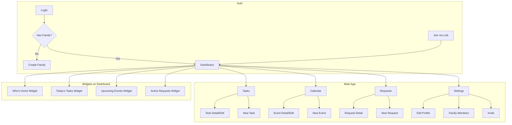

# BigMama - UI/UX Design Document

> **Version:** 1.0  
> **Last Updated:** 2026-01-16  
> **Status:** Ready for Implementation

---

## 1. Target Audience & Design Goals

### 1.1 Who is BigMama For?

**Primary Users:** Israeli families (2-6 members)
- Parents (30-50 years old) — primary admins
- Children/teens (10+ years old) — task participants
- Tech comfort: Medium (uses WhatsApp, basic apps)

**Usage Context:**
- Quick check-ins throughout the day (mobile, 30 sec - 2 min)
- Planning sessions (tablet/desktop, 5-10 min)
- On-the-go updates (mobile, while commuting)

### 1.2 Design Goals

| Goal | How We Achieve It |
|------|-------------------|
| **Quick to scan** | Card-based UI, visual hierarchy, status at a glance |
| **Easy to act** | Large touch targets, minimal taps to complete actions |
| **Family-friendly** | Warm colors, playful avatars, encouraging language |
| **Hebrew-first** | RTL layout, Hebrew typography, local calendar |
| **Responsive** | Mobile-first design that scales to tablet/desktop |

---

## 2. Design System

### 2.1 Color Palette

```css
/* Primary */
--color-primary: #7C5CFF;        /* Purple - actions, active states */
--color-primary-light: #E8E4FF;  /* Light purple - backgrounds */
--color-primary-dark: #5A3FD9;   /* Dark purple - pressed states */

/* Semantic */
--color-success: #22C55E;        /* Green - completed, approved */
--color-warning: #F59E0B;        /* Amber - overdue, attention */
--color-error: #EF4444;          /* Red - rejected, delete */
--color-info: #3B82F6;           /* Blue - info, links */

/* Neutral */
--color-background: #F8F7FC;     /* Page background */
--color-surface: #FFFFFF;        /* Cards */
--color-text: #1F2937;           /* Primary text */
--color-text-secondary: #6B7280; /* Secondary text */
--color-border: #E5E7EB;         /* Borders */

/* Status Colors */
--color-home: #22C55E;           /* 🏠 Home - green */
--color-away: #F59E0B;           /* 🚗 Away - amber */

/* Shabbat/Holiday */
--color-shabbat: #7C5CFF;        /* Purple highlight for Saturday */
--color-holiday: #F59E0B;        /* Amber for holidays */

/* Member Colors (assignable) */
--color-member-1: #FF6B6B;       /* Coral */
--color-member-2: #4ECDC4;       /* Teal */
--color-member-3: #45B7D1;       /* Sky blue */
--color-member-4: #96CEB4;       /* Sage */
--color-member-5: #FFEAA7;       /* Yellow */
--color-member-6: #DDA0DD;       /* Plum */
```

### 2.2 Typography

```css
/* Font Family */
--font-family: 'Heebo', 'Inter', sans-serif;
/* Heebo is Google's Hebrew font, Inter as fallback for English */

/* Font Sizes */
--text-xs: 0.75rem;    /* 12px - badges, timestamps */
--text-sm: 0.875rem;   /* 14px - secondary text */
--text-base: 1rem;     /* 16px - body text */
--text-lg: 1.125rem;   /* 18px - card titles */
--text-xl: 1.25rem;    /* 20px - section headers */
--text-2xl: 1.5rem;    /* 24px - page titles */

/* Font Weights */
--font-normal: 400;
--font-medium: 500;
--font-semibold: 600;
--font-bold: 700;
```

### 2.3 Spacing & Sizing

```css
/* Spacing Scale */
--spacing-xs: 0.25rem;  /* 4px */
--spacing-sm: 0.5rem;   /* 8px */
--spacing-md: 1rem;     /* 16px */
--spacing-lg: 1.5rem;   /* 24px */
--spacing-xl: 2rem;     /* 32px */

/* Border Radius */
--radius-sm: 0.375rem;  /* 6px - small elements */
--radius-md: 0.75rem;   /* 12px - cards */
--radius-lg: 1rem;      /* 16px - modals */
--radius-full: 9999px;  /* Pills, avatars */

/* Touch Targets */
--touch-min: 44px;      /* Minimum touch target size */
```

### 2.4 Shadows & Elevation

```css
--shadow-sm: 0 1px 2px rgba(0, 0, 0, 0.05);
--shadow-md: 0 4px 6px rgba(0, 0, 0, 0.05), 0 2px 4px rgba(0, 0, 0, 0.03);
--shadow-lg: 0 10px 15px rgba(0, 0, 0, 0.1), 0 4px 6px rgba(0, 0, 0, 0.05);
```

---

## 3. Screen Inventory

### 3.1 Screen Map



### 3.2 Screen List (MVP)

| Screen | Route | Description | Priority |
|--------|-------|-------------|----------|
| Login | `/login` | Google Sign-In | P0 |
| Create Family | `/onboarding/create` | New family setup | P0 |
| Join Family | `/join/:code` | Join via invite | P0 |
| Dashboard | `/` | Home screen with widgets | P0 |
| Tasks | `/tasks` | Task list view | P0 |
| Task Form | `/tasks/new`, `/tasks/:id` | Create/Edit task | P0 |
| Calendar | `/calendar` | Weekly + Agenda views | P0 |
| Event Form | `/calendar/new`, `/calendar/:id` | Create/Edit event | P0 |
| Requests | `/requests` | Request list with voting | P0 |
| Request Form | `/requests/new` | Create request | P0 |
| Status | `/status` | Who's Home full view | P1 |
| Settings | `/settings` | Profile & family settings | P0 |
| Invite | `/settings/invite` | Generate invite links | P0 |

---

## 4. Screen Mockups

### 4.1 Dashboard

The home screen showing today's overview with key widgets.


**Key Elements:**
- Greeting header with user name
- Who's Home widget (4 avatars with status)
- Today's Tasks widget (task cards with progress)
- Upcoming Events widget (event list)
- Active Requests widget (voting preview)
- Bottom navigation bar

---

### 4.2 Tasks

Full task management view with filtering.


**Key Elements:**
- Filter tabs: "הכל" (All) / "שלי" (Mine)
- Show completed toggle
- Task cards with checkbox, title, due date, assignee dots
- Floating action button for new task
- Bottom navigation

---

### 4.3 Calendar

Weekly calendar with Hebrew dates and events.


**Key Elements:**
- Week navigation (prev/next, today button)
- Day cells with Gregorian + Hebrew dates
- Shabbat highlighting (purple)
- Hebrew holiday display (ט״ו בשבט)
- Event cards with colored borders
- View toggle: שבוע (Week) / אג'נדה (Agenda)

---

### 4.4 Requests

Request/suggestion list with voting system.


**Key Elements:**
- Filter pills: פתוחות / אושרו / הכל
- Request cards with:
  - Type badge (הצעה / הודעה / אושר)
  - Title and description
  - Author avatar
  - Vote buttons with counts (👍 / 👎)
  - Time remaining badge
- Floating action button

---

### 4.5 Settings

User profile and family management.


**Key Elements:**
- Profile section with avatar, name, email
- Edit profile button
- Family section: name, members count
- Invite buttons (parent/member)
- Language toggle (עברית / English)
- Logout button

---

## 5. Component Library

### 5.1 Core Components

| Component | Variants | Usage |
|-----------|----------|-------|
| `Button` | Primary, Secondary, Ghost, Danger | Actions |
| `Card` | Default, Elevated, Interactive | Content containers |
| `Avatar` | Emoji, Photo, Initials | Member display |
| `Badge` | Status, Count, Type | Labels |
| `Input` | Text, Textarea, Select | Forms |
| `Checkbox` | Default, Radio style | Task completion |
| `Toggle` | Default | Settings switches |
| `Modal` | Bottom sheet (mobile), Center (desktop) | Forms, confirmations |
| `Tabs` | Underline, Pills | Navigation, filters |

### 5.2 Feature Components

| Component | Description |
|-----------|-------------|
| `TaskCard` | Task display with checkbox, assignees, due date |
| `EventCard` | Calendar event with color, time, title |
| `RequestCard` | Request with voting buttons |
| `StatusCard` | Member with avatar and status toggle |
| `MemberPicker` | Multi-select for task/event assignment |
| `DatePicker` | Gregorian + Hebrew calendar picker |
| `TimePicker` | Hour:minute selector |
| `ColorPicker` | Preset color palette selector |
| `EmojiPicker` | Avatar emoji selection |

---

## 6. Responsive Behavior

### 6.1 Breakpoints

```css
/* Mobile-first approach */
--bp-sm: 375px;   /* Small phone */
--bp-md: 768px;   /* Tablet */
--bp-lg: 1024px;  /* Desktop */
--bp-xl: 1280px;  /* Large desktop */
```

### 6.2 Layout Changes

| Breakpoint | Navigation | Layout | Cards |
|------------|------------|--------|-------|
| Mobile (<768px) | Bottom tab bar | Single column | Full width |
| Tablet (768-1023px) | Side rail | 2 columns | Grid |
| Desktop (≥1024px) | Side navigation | Multi-column | Grid |

### 6.3 Dashboard Responsive Grid

```
Mobile:        Tablet:           Desktop:
┌──────────┐   ┌──────┬───────┐  ┌──────┬───────┬───────┐
│ Who's    │   │ Who's│ Tasks │  │      │ Tasks │ Events│
│ Home     │   │ Home │       │  │Who's │       │       │
├──────────┤   ├──────┴───────┤  │Home  ├───────┴───────┤
│ Tasks    │   │ Events       │  │      │ Requests      │
├──────────┤   ├──────────────┤  │      │               │
│ Events   │   │ Requests     │  └──────┴───────────────┘
├──────────┤   └──────────────┘
│ Requests │
└──────────┘
```

---

## 7. RTL (Right-to-Left) Guidelines

### 7.1 Layout Principles

- Text flows right-to-left
- Icons with direction (arrows) must flip
- Navigation starts from right
- Checkboxes/toggles on right side of labels
- Numerical values remain LTR

### 7.2 CSS Approach

```css
/* Use logical properties */
.card {
  margin-inline-start: var(--spacing-md);  /* Not margin-left */
  padding-inline-end: var(--spacing-sm);    /* Not padding-right */
  text-align: start;                        /* Not text-align: left */
}

/* Set at HTML root */
html {
  direction: rtl;
}

/* Flip directional icons */
[dir="rtl"] .icon-arrow-left {
  transform: scaleX(-1);
}
```

---

## 8. Interaction Patterns

### 8.1 Task Completion

```
User taps checkbox → 
  Checkbox animates (check appears) →
  Task card fades slightly →
  Success haptic feedback →
  (Optional toast: "משימה הושלמה ✓")
```

### 8.2 Voting

```
User taps 👍 →
  Button fills with color →
  Count increments with animation →
  If changing vote: previous button unfills
```

### 8.3 Status Change

```
User taps status toggle →
  Toggle slides with inertia →
  Emoji updates →
  Status text changes →
  Syncs to other devices in real-time
```

### 8.4 Pull to Refresh

Available on all list views (Tasks, Requests, Calendar Agenda)

---

## 9. Empty States

| Screen | Empty State Message | Action |
|--------|---------------------|--------|
| Tasks | "אין משימות עדיין" (No tasks yet) | "+ צור משימה ראשונה" |
| Calendar | "אין אירועים השבוע" (No events this week) | "+ הוסף אירוע" |
| Requests | "אין בקשות פתוחות" (No open requests) | "+ צור בקשה" |

---

## 10. Loading & Error States

### 10.1 Loading

- Skeleton screens for initial load (not spinners)
- Inline loading for actions (button shows spinner)
- Optimistic updates where possible

### 10.2 Errors

- Inline error messages near the source
- Toast notifications for transient errors
- Full-page error for critical failures
- Always provide retry option

---

## 11. Accessibility

| Requirement | Implementation |
|-------------|----------------|
| Touch targets | Minimum 44x44px |
| Color contrast | WCAG AA (4.5:1 for text) |
| Focus states | Visible focus ring on all interactive elements |
| Screen reader | Semantic HTML, ARIA labels where needed |
| Motion | Respect `prefers-reduced-motion` |

---

## 12. External Design Tools

### Figma (Future)

For higher-fidelity design work, consider creating a Figma file with:
- Design tokens (colors, typography, spacing)
- Component library
- Page mockups
- Interactive prototypes

**Recommended Figma plugins:**
- RTL Support Plugin
- Hebrew Calendar Component
- Auto Layout for responsive design

---

## Appendix: Mockup Generator Prompts

For generating additional mockups, use these prompts:

**Login Screen:**
> Mobile app UI mockup for a Login/Welcome page for "BigMama" family app. Centered logo (house with heart), app name, Hebrew tagline "ניהול משפחתי חכם", "Sign in with Google" button. Soft purple gradient background. 375px width.

**Status Screen:**
> Mobile app UI mockup for "Who's Home" status page. RTL Hebrew layout. Grid of 4 family member cards with avatars, names, status toggles (Home/Away). Date selector at top. 375px width.
